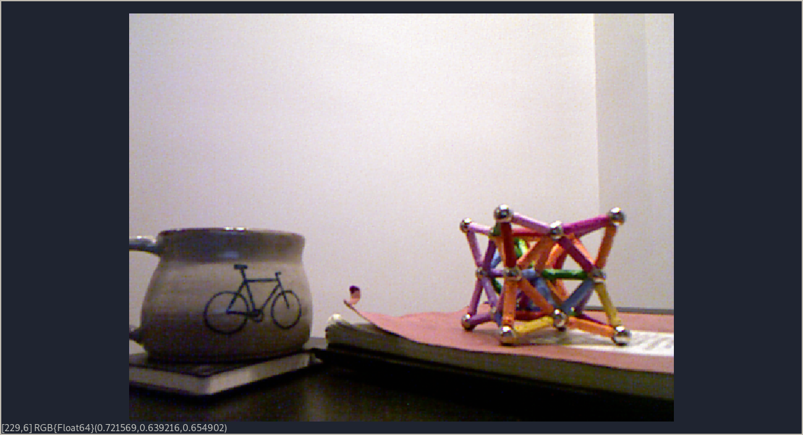
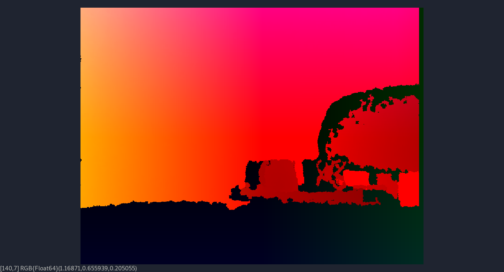

# Displaying Images

Freenect.jl doesn't come with any image-specific utilities out of the box, it
only returns arrays of data.

Here are some examples of using the [JuliaImages](https://juliaimages.org)
suite to display data from the Kinect.

Before running these examples, be sure to install the relevant packages.

```julia
using Pkg
Pkg.add("Images")
Pkg.add("ImageView")
```

## RGB Image

```julia
using Freenect, Images, ImageView

image, timestamp = sync_get_video(0, video_rgb)
imshow(colorview(RGB, image ./ 255))
```


## Infrared Image

```julia
using Freenect, Images, ImageView

image, timestamp = sync_get_video(0, video_ir_8bit)
imshow(colorview(Gray, image ./ 255))
```


## Depth Image

These images often appear washed out when directly visualized, and anything
below the minimum range appears in white.

```julia
using Freenect, Images, ImageView

depth, timestamp = sync_get_depth(0, depth_11bit)
imshow(colorview(Gray, depth ./ 2^11))
```


## Point Cloud Image

While XYZ to RGB isn't the cleanest visualizer, it works in a pinch.

```julia
using Freenect, Images, ImageView

cloud, timestamp = sync_get_pointcloud(0)
imshow(colorview(RGB, cloud))
```
